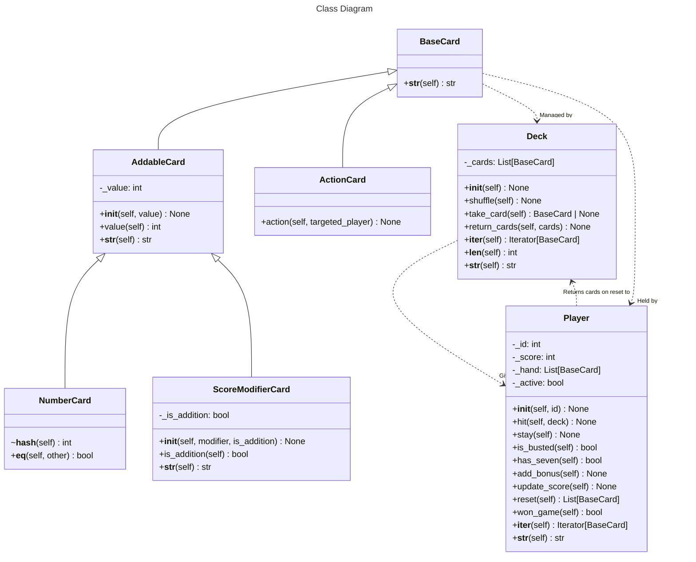

```mermaid
---
title: Class Diagram
---
classDiagram
    class BaseCard {
        +__str__(self) str
    }

    class AddableCard {
        -_value: int
        +__init__(self, value) None
        +value(self) int
        +__str__(self) str
    }
    BaseCard <|-- AddableCard

    class NumberCard {
        ~__hash__(self) int
        +__eq__(self, other) bool
    }
    AddableCard <|-- NumberCard

    class ScoreModifierCard {
        -_is_addition: bool
        +__init__(self, modifier, is_addition) None
        +is_addition(self) bool
        +__str__(self) str
    }
    AddableCard <|-- ScoreModifierCard

    class ActionCard {
        +action(self, targeted_player) None
    }
    BaseCard <|-- ActionCard


    class Deck {
        -_cards: List[BaseCard]
        +__init__(self) None
        +shuffle(self) None
        +take_card(self) BaseCard | None
        +return_cards(self, cards) None
        +__iter__(self) Iterator[BaseCard]
        +__len__(self) int
        +__str__(self) str
    }
    BaseCard ..> "Managed by" Deck


    class Player {
        -_id: int
        -_score: int
        -_hand: List[BaseCard]
        -_active: bool
        +__init__(self, id) None
        +hit(self, deck) None
        +stay(self) None
        +is_busted(self) bool
        +has_seven(self) bool
        +add_bonus(self) None
        +update_score(self) None
        +reset(self) List[BaseCard]
        +won_game(self) bool
        +__iter__(self) Iterator[BaseCard]
        +__str__(self) str
    } 
    Deck ..> "Gives cards to on hit" Player
    Player ..> "Returns cards on reset to" Deck
    BaseCard ..> "Held by" Player
```
